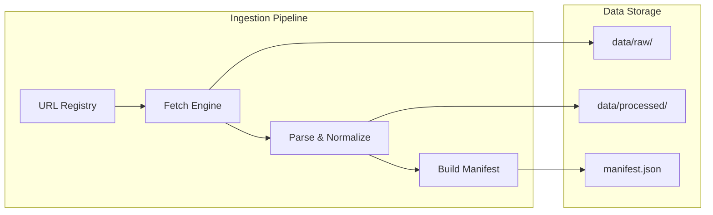

# Mutual Fund FAQ Assistant (Facts-Only RAG)

A comprehensive facts-only Retrieval-Augmented Generation (RAG) assistant for mutual fund FAQ queries, using **HDFC Mutual Fund** as the reference AMC.

> **Facts-only. No investment advice.**

## Overview

This project implements a production-ready RAG system with 9 phases of development, covering ingestion, chunking, vector indexing, retrieval, generation, API development, frontend UI, and evaluation. The assistant strictly avoids investment advice, opinions, or recommendations while providing accurate, source-cited answers.

## Current Status: Phase 9 Complete

✅ **Phase 0** - Product and compliance baseline  
✅ **Phase 1** - Corpus acquisition and document registry  
✅ **Phase 2** - Chunking, metadata, and indexing preparation  
✅ **Phase 3** - Vector embeddings and similarity search  
✅ **Phase 4** - RAG retrieval and context packing  
✅ **Phase 5** - Answer generation with guardrails  
✅ **Phase 6** - Multi-threading and session management  
✅ **Phase 7** - Backend API development  
✅ **Phase 8** - Frontend UI development  
✅ **Phase 9** - Evaluation and testing framework  

🎉 **Production Ready** - All phases complete with comprehensive testing and evaluation

## Scope (Phase 1)

### Asset Management Company
- **HDFC Mutual Fund** - Large AMC with comprehensive public documentation

### Selected Schemes (5 schemes across categories)
1. **HDFC Large Cap Fund** - Large Cap Equity
2. **HDFC Flexi Cap Fund** - Flexi Cap Equity  
3. **HDFC ELSS Tax Saver** - ELSS (Tax Saver Equity)
4. **HDFC Mid Cap Fund** - Mid Cap Equity
5. **HDFC Short Term Debt Fund** - Short Duration Debt

### Source URLs (15 official sources)
- AMC homepage and scheme pages
- Investor service and contact pages
- Statutory disclosure hub
- Investor portal links
- SEBI regulator pages

## Architecture Overview



## Phase Overview

| Phase | Component | Status | Key Features |
|-------|-----------|---------|--------------|
| **0** | Baseline | ✅ Complete | Product requirements, compliance framework |
| **1** | Corpus | ✅ Complete | HDFC MF data ingestion, 15 official sources |
| **2** | Chunking | ✅ Complete | Section-aware chunking, metadata enrichment |
| **3** | Vectors | ✅ Complete | BGE embeddings, Chroma vector store, BM25 hybrid |
| **4** | Retrieval | ✅ Complete | Intent routing, context packing, retrieval engine |
| **5** | Generation | ✅ Complete | LLM generation with guardrails, refusal logic |
| **6** | Multi-thread | ✅ Complete | Session management, SQLite storage |
| **7** | Backend API | ✅ Complete | FastAPI REST API, thread management |
| **8** | Frontend UI | ✅ Complete | Next.js UI, real-time chat, citations |
| **9** | Evaluation | ✅ Complete | Golden Q&A testing, hit@k metrics, evaluation framework |

## Tech Stack

### Core Technologies

| Layer | Technology | Purpose |
|-------|------------|---------|
| **Runtime** | Python 3.11+ | Core application logic and data processing |
| **Package Management** | pip + requirements.txt | Dependency management |
| **Configuration** | YAML | Structured configuration for AMC, schemes, and URLs |
| **Frontend** | Next.js 14+ | React-based UI with TypeScript |
| **Backend** | FastAPI | High-performance REST API |
| **Database** | SQLite, ChromaDB | Session storage and vector database |

### Retrieval & Generation

| Component | Technology | Purpose |
|-----------|------------|---------|
| **Embeddings** | BGE (BAAI/bge-small-en-v1.5) | Text vectorization for semantic search |
| **Vector Store** | ChromaDB | Local vector database for similarity search |
| **Lexical Search** | BM25 | Traditional keyword search for hybrid retrieval |
| **Hybrid Retrieval** | Custom implementation | Combines semantic and lexical search |
| **LLM** | OpenAI/Groq APIs | Answer generation with guardrails |
| **Intent Routing** | Custom classifier | Routes queries to appropriate retrieval paths |

### Frontend Technologies

| Component | Technology | Purpose |
|-----------|------------|---------|
| **UI Framework** | Next.js 14+ | React-based frontend with SSR |
| **Styling** | TailwindCSS | Utility-first CSS framework |
| **TypeScript** | TypeScript | Type-safe frontend development |
| **State Management** | React hooks | Component state management |
| **API Client** | Fetch API | Backend communication |

## Retrieval Mechanism

### Hybrid Retrieval System

The system implements a sophisticated hybrid retrieval mechanism combining:

1. **Semantic Search** (BGE Embeddings + ChromaDB)
   - Vector similarity search using BGE small English model
   - Captures semantic meaning and context
   - Handles paraphrases and synonyms

2. **Lexical Search** (BM25)
   - Traditional keyword-based search
   - Exact term matching and relevance scoring
   - Handles specific scheme names and technical terms

3. **Hybrid Fusion** (α = 0.5)
   - Combines semantic and lexical scores
   - Balances meaning and keyword precision
   - Configurable fusion parameter

### Intent Routing

- **Factual Queries**: Standard retrieval pathway
- **Advisory Queries**: Refusal with educational links
- **Performance Queries**: Factsheet URL retrieval
- **PII Queries**: Security warning and refusal

### Context Packing

- **Source Attribution**: All answers include citation URLs
- **Context Limits**: Enforced token limits for LLM input
- **Relevance Ranking**: Top-k results with relevance scoring
- **Metadata Enrichment**: Scheme names and document types

### Ingestion & Processing (Phase 1)

| Component | Technology | Purpose |
|-----------|------------|---------|
| **HTTP Client** | `requests` | Web scraping with retries and rate limiting |
| **HTML Parsing** | `beautifulsoup4` | Extract clean text from HTML pages |
| **PDF Processing** | `PyMuPDF` | Parse PDF documents (future phases) |
| **Text Processing** | `trafilatura` | Content extraction and normalization |
| **Logging** | Python `logging` | Structured logging for ingestion pipeline |

### Data Storage

| Storage Type | Technology | Purpose |
|--------------|------------|---------|
| **Raw Artifacts** | Local filesystem | Original fetched files (HTML, PDF) |
| **Processed Text** | Local filesystem | Normalized text files |
| **Metadata** | JSON (manifest.json) | Provenance and processing metadata |
| **Configuration** | YAML files | AMC schemes, URL registry, policies |

### Planned Technologies (Future Phases)

| Phase | Technology | Purpose |
|-------|------------|---------|
| **Phase 2-3** | `sentence-transformers` | Text embeddings for semantic search |
| **Phase 2-3** | Chroma / LanceDB | Local vector database |
| **Phase 2-3** | `whoosh` | BM25 lexical search (hybrid retrieval) |
| **Phase 4-5** | OpenAI / Anthropic APIs | LLM for answer generation |
| **Phase 6** | SQLite / Redis | Session storage for multi-thread support |
| **Phase 7** | Next.js | Frontend UI and API routes |
| **Phase 7** | TypeScript | Type-safe frontend development |

### Development Tools

| Tool | Purpose |
|------|---------|
| **Git** | Version control |
| **Python venv** | Environment isolation |
| **VS Code** | Development environment |
| **Mermaid** | Architecture diagrams |

### Architecture Principles

- **Lightweight**: Minimal dependencies, local-first approach
- **Modular**: Clear separation between ingestion, retrieval, and generation
- **Compliant**: Built-in source allowlist/blocklist for regulatory compliance
- **Extensible**: Configuration-driven design for adding new AMCs/schemes
- **Traceable**: Full provenance tracking from source URL to answer

## Quick Setup

### Prerequisites
- Python 3.11+
- Node.js 18+
- Git

### Installation

1. **Clone the repository**
   ```bash
   git clone <repository-url>
   cd Groww-RAG-MutualFundFAQAssistant
   ```

2. **Backend Setup**
   ```bash
   # Create virtual environment
   python -m venv venv
   # Windows
   venv\Scripts\activate
   # Unix/MacOS
   source venv/bin/activate

   # Install dependencies
   pip install -r requirements.txt

   # Environment configuration
   cp .env.example .env
   # Edit .env with your API keys
   ```

3. **Frontend Setup**
   ```bash
   cd frontend
   npm install
   cd ..
   ```

### Running the System

#### Backend Server (Port 8000)
```bash
# Start the Phase 7 API
python src/scripts/run_phase7_api.py --port 8000
```

#### Frontend Server (Port 3000)
```bash
# Start the Phase 8 frontend
cd frontend
npm run dev
```

#### Alternative Frontend Startup
```bash
# Use the provided start script
node frontend/start-frontend.js
```

### Access Points
- **Frontend UI**: http://localhost:3000
- **Backend API**: http://localhost:8000/api/v1
- **API Documentation**: http://localhost:8000/docs
- **Health Check**: http://localhost:8000/api/v1/health


### Testing

```bash
# Run Phase 9 evaluation
python src/phase9/evaluation/test_retrieval_hit_at_k.py
```

### Project Structure

```
Grow-RAG-MutualFundFAQAssistant/
├── README.md                          # This file
├── requirements.txt                   # Python dependencies
├── .env.example                       # Environment template
├── config/                            # Configuration files
│   ├── amc_schemes.yaml              # AMC and schemes definition
│   ├── url_registry.yaml             # Source URLs (15 official sources)
│   ├── retrieval.yaml                # Retrieval system configuration
│   ├── source_allowlist.txt           # Allowed domains
│   └── source_blocklist.txt           # Blocked patterns
├── src/                               # Source code
│   ├── phase1_corpus/                 # Corpus acquisition
│   ├── phase2_chunking/               # Document chunking
│   ├── phase3_indexing/               # Vector indexing
│   ├── phase4_retrieval/              # RAG retrieval
│   ├── phase5_generation/             # Answer generation
│   ├── phase6_multithread/            # Session management
│   ├── phase7_api/                    # Backend API
│   ├── phase8_frontend/               # Frontend integration
│   ├── phase9_evaluation/            # Testing framework
│   └── scripts/
│       └── run_phase7_api.py         # API startup script
├── frontend/                          # Next.js frontend
│   ├── src/                          # React components
│   ├── pages/                        # Next.js pages
│   ├── public/                       # Static assets
│   ├── package.json                  # Frontend dependencies
│   └── start-frontend.js             # Startup script
├── data/                              # Data storage (gitignored)
│   ├── raw/                           # Original fetched files
│   ├── processed/                     # Normalized text + manifest
│   ├── index/                         # Chroma vector store
│   └── bm25/                          # BM25 index
├── evaluations/                        # Phase 9 test results
├── logs/                              # Application logs
├── doc/                               # Documentation
│   ├── problemStatement.md            # Requirements
│   ├── phased-architecture.md        # Detailed phase plan
│   └── sample_qa.md                  # Golden Q&A for testing
```

## Key Features

### ✅ Production Ready
- **Complete RAG Pipeline**: 9-phase development from ingestion to evaluation
- **Hybrid Retrieval**: Semantic + lexical search with intent routing
- **Guardrails**: Advisory question refusal and PII protection
- **Citations**: All answers include source URLs
- **Multi-thread**: Session management with SQLite storage


### 🔒 Compliance
- **Facts-Only**: No investment advice or recommendations
- **Source Control**: Only official AMC/AMFI/SEBI sources
- **PII Protection**: Automatic PII detection and refusal
- **Audit Trail**: Full provenance tracking

## Known Limitations

### Current Scope
- **Single AMC Focus**: HDFC Mutual Fund schemes only
- **Static Corpus**: Manual re-ingestion required for updates
- **English Only**: No multi-language support
- **Text Sources**: PDF processing limited

### Technical Limitations
- **Single LLM**: No model routing or fallbacks
- **Basic Monitoring**: No advanced analytics

### Compliance Limitations
- **No PII Processing**: Cannot handle personal identification
- **No Performance Data**: Returns queries redirect to official sources
- **No Comparisons**: Cannot compare schemes or provide recommendations
- **Educational Only**: All responses are informational

## Configuration Files

### AMC and Schemes (`config/amc_schemes.yaml`)
Defines the selected AMC and 5 schemes with category diversity.

### URL Registry (`config/url_registry.yaml`)
Contains 15 official URLs with metadata:
- Document types (scheme_page, factsheet_index, etc.)
- Source ownership (AMC, SEBI)
- Verification status
- Scope filtering for current iteration

### Source Policies
- `config/source_allowlist.txt` - Allowed domains (hdfcfund.com, sebi.gov.in)
- `config/source_blocklist.txt` - Blocked patterns (blogs, aggregators)

## Next Steps (Phase 2)

Phase 2 will implement:
- **Chunking strategy** - Section-aware and fixed-size chunking
- **Metadata enrichment** - Source URLs, document types, timestamps
- **Indexing preparation** - Vector store and BM25 setup

## Contributing

1. Follow the phased architecture in `doc/phased-architecture.md`
2. Update configuration files when adding new sources
3. Maintain the facts-only constraint in all implementations
4. Test with the golden query set before major changes

## Compliance Notice

This system is designed for **informational purposes only**. It does not provide investment advice, recommendations, or opinions. All responses are based on publicly available official sources and should be verified with the respective AMC or regulatory authorities.

---

## Contributing

1. Follow the phased architecture in `doc/phased-architecture.md`
2. Run Phase 9 evaluation before major changes
3. Maintain facts-only constraint in all implementations
4. Update documentation when adding new features
5. Test with both Ubuntu and Windows environments

## Architecture Documentation

- **Phase Details**: `doc/phased-architecture.md`
- **Problem Statement**: `doc/problemStatement.md`
- **Evaluation Results**: `doc/sample_qa.md`

## Compliance Notice

This system is designed for **informational purposes only**. It does not provide investment advice, recommendations, or opinions. All responses are based on publicly available official sources and should be verified with the respective AMC or regulatory authorities.

---

**Last updated**: Phase 9 implementation complete  
**Status**: Production ready with comprehensive evaluation and testing  
**Tech Stack**: Python 3.11+, Next.js 14+, FastAPI, ChromaDB  
**Retrieval**: Hybrid semantic + lexical search with intent routing
