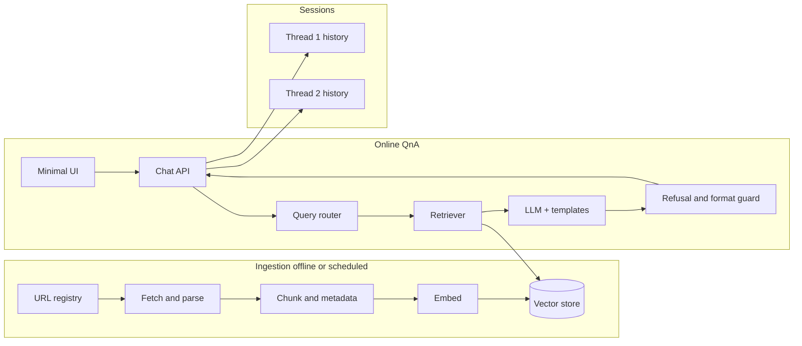
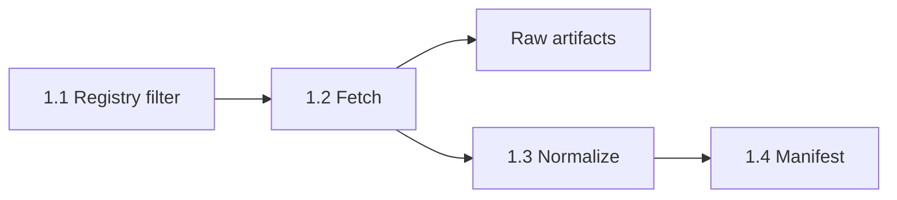
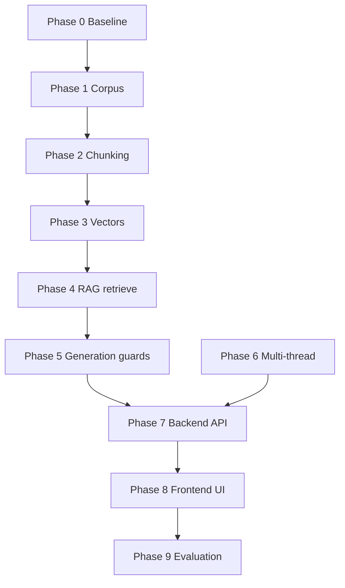

# Phase-Wise Architecture: Mutual Fund FAQ Assistant (Facts-Only RAG)

This document turns the requirements in [problem statement](./problemStatement.md) into a **sequenced build plan**: phases, components, data flows, and interfaces. It is implementation-agnostic where possible; you can map each phase to concrete tools (e.g. LangChain, LlamaIndex, Haystack, or custom code).

---

## Guiding principles (apply to every phase)

| Principle | Architectural implication |
|-----------|---------------------------|
| Facts-only | Separate **retrieval** from **generation**; constrain the LLM with retrieved chunks and a strict system prompt. |
| Single official citation | Retrieval returns **one primary chunk** (or you **select** one post-retrieval); the generator must not invent URLs. |
| No PII | No auth flows, no forms for PAN/Aadhaar/phone/email; logs must redact or omit user identifiers. |
| Traceability | Store **source URL**, **document type**, and **fetch / index timestamp** with every chunk. |
| Multi-chat | **Session isolation**: each conversation gets its own thread id; history and optional memory are scoped per thread. |

**Path convention (Phases 0–8):** In each *Files Created* tree, paths are **relative to the repository root** (the folder that will contain `README.md`). Entries marked **(gitignored)** are generated or runtime artifacts—keep them out of version control via `.gitignore`.

---

## High-level system view



---

## Phase 0 — Product and compliance baseline

**Goal:** Lock scope so later phases do not rework corpus or policy.

| Work item | Detail |
|-----------|--------|
| Source policy | Written allowlist: AMC domain(s), `amfiindia.com`, `sebi.gov.in` (and any AMC subdomains you explicitly add). Blocklist pattern for blogs and aggregators. |
| AMC and schemes | One AMC; 3–5 schemes across categories (e.g. large-cap, flexi-cap, ELSS). |
| URL registry | 15–25 URLs with labels: factsheet,FAQ, SEBI page. Version this file in git. |
| Answer contract | Max **3 sentences**; **exactly one** citation URL; footer `Last updated from sources: <date>`; refusals must include **one** educational link. |
| Performance queries | Policy: no numbers from the model—**factsheet link only** (optionally one sentence: “See the official factsheet for performance data.”). |

### Out of Scope for Now (current iteration)

The current iteration intentionally excludes these source classes from active ingestion and retrieval:

- **AMC PDFs** such as **KIM** and **SID** documents.
- **AMFI guidance pages** (including investor education/knowledge-center pages).
- **Statement and tax-related documents** (including capital-gains and statement download flows).

These remain planned sources for future phases. The ingestion pipeline must support adding them later by **URL-registry/config updates only**, without redesigning fetch, normalization, chunking, or indexing architecture.

### Files Created

```text
doc/
  POLICY.md                    # source allowlist / blocklist rules, answer &   
                                  refusal contract
  templates/
    answer_footer.txt          # optional: fixed footer line pattern
    refusal_educational_links.yaml
config/
  source_allowlist.txt         # domains and URL prefixes permitted for citations
  source_blocklist.txt         # patterns to reject (blogs, aggregators)
  amc_schemes.yaml             # chosen AMC + 3–5 schemes and categories
  url_registry.yaml            # 15–25 official URLs with doc_type, scheme, notes
```

**Exit criteria:** Signed-off URL list + answer/refusal templates documented (can live in `README` or a short `POLICY.md`).

---

## Phase 1 — Corpus acquisition and document registry

**Goal:** Reproducible corpus tied to official URLs and capture dates.

### Subphases (implement one by one)

#### Phase 1.1 — Registry finalization and scope filter

**Goal:** Freeze the run input list for the current iteration.

- Validate `config/url_registry.yaml` schema (`id`, `url`, `doc_type`, `source_owner`, `verification_status`, `in_scope_current_iteration`).
- Apply current-iteration scope filter (exclude out-of-scope doc types/pages).
- Produce a deterministic fetch list for this run only.

**Primary output:** A resolved list of in-scope URLs ready for fetch.

#### Phase 1.2 — Fetch engine and raw artifact capture

**Goal:** Reliably download all in-scope source pages/files.

- Build fetcher with retries, timeout, user-agent, and polite rate limiting.
- Respect `robots.txt` and record fetch failures without breaking the whole run.
- Save raw responses in artifact storage with stable naming and hashes.

**Primary output:** `data/raw/` artifacts + basic fetch logs.

#### Phase 1.3 — Parsing and normalization

**Goal:** Convert raw files into clean, index-ready text.

- Parse HTML/PDF (and DOCX if encountered).
- Strip boilerplate where needed; preserve meaningful section boundaries when possible.
- Emit one normalized text output per fetched document id.

**Primary output:** `data/processed/text/` normalized files.

#### Phase 1.4 — Manifest and provenance build

**Goal:** Make every normalized document auditable.

- Build `manifest.json` with `doc_id`, `source_url`, `doc_type`, `scheme`, `fetched_at`, content hash, parse status.
- Ensure every in-scope successful fetch has provenance metadata.
- Mark failures/skips explicitly (do not silently drop).

**Primary output:** `data/processed/manifest.json`.

### Data flow (for all subphases)



### Files Created (cumulative across Phase 1 subphases)

```text
src/
  phase1_ingest/
    __init__.py
    registry.py                # 1.1 URL registry validation and scope filtering
    fetch.py                   # 1.2 HTTP fetch, retries, robots.txt handling
    normalize.py               # 1.3 PDF/HTML → clean text; stable doc ids (future)
    manifest.py                # 1.4 provenance + processing manifest (future)
  scripts/
    run_fetch.py               # 1.1–1.5 CLI entrypoint for full corpus pull
data/
  artifacts/                   # (gitignored) Phase artifacts and metadata
    phase_1_1_registry.json    # 1.1 Validated and filtered URL list
    phase_1_2_fetch.json       # 1.2 Fetch results and raw file paths
  raw/                         # (gitignored) 1.2 mirrored originals, e.g. *.pdf, *.html
  processed/
    text/                      # (gitignored) 1.3 one normalized .txt (or .md) per doc_id (future)
    manifest.json              # (gitignored) 1.4 doc_id, source_url, fetched_at, content_hash (future)

                           # (gitignored) 1.2–1.5 structured 
requirements.txt               # Dependencies for Phase 1.1-1.2
.gitignore                     # updated: data/raw/, data/
                            processed/, logs/, data/artifacts/
```

### Files Created by Subphase

**Phase 1.1 - Registry finalization and scope filter:**
- `src/phase1_ingest/registry.py` - URL validation, scope filtering, artifact generation
- `data/artifacts/phase_1_1_registry.json` - Filtered URL list for current iteration

**Phase 1.2 - Fetch engine and raw artifact capture:**
- `src/phase1_ingest/fetch.py` - HTTP fetcher with retries, rate limiting, robots.txt handling
- `src/scripts/run_fetch.py` - CLI orchestrator for Phase 1.1-1.5
- `requirements.txt` - Dependencies (PyYAML, requests, urllib3)
- `data/artifacts/phase_1_2_fetch.json` - Fetch results with hashes and file paths
- `data/raw/` - Raw fetched artifacts (HTML, PDF files)

**Phase 1.3 - Parsing and normalization (planned):**
- `src/phase1_ingest/normalize.py` - HTML/PDF parsing to clean text
- `data/processed/text/` - Normalized text files
- `data/artifacts/phase_1_3_normalize.json` - normalize results 

**Phase 1.4 - Manifest and provenance build (planned):**
- `src/phase1_ingest/manifest.py` - Provenance tracking and manifest generation
- `data/processed/manifest.json` - Complete document metadata
- `data/artifacts/phase_1_4_manifest.json` - manifest results 

**Phase 1.5 - Quality gate and handoff to Phase 2 (planned):**
- Quality validation scripts and readiness checklist

**Exit criteria (Phase 1 complete):** All in-scope URLs for the current iteration are fetched or explicitly marked failed; normalization quality is spot-checked; every successful document has `source_url` and `fetched_at` provenance in manifest.

**Additional Note:** It is crucial to ensure that the manifest generation and quality gate processes are thoroughly tested to guarantee the accuracy and reliability of the corpus.

## Phase 2 — Chunking, metadata, and indexing preparation

**Goal:** Retrieval units that align with “one fact + one source.”

### Chunking strategy

- **PDFs (factsheets):** Chunk by heading/section where possible; else fixed size with overlap (e.g. 512–800 tokens, 10–15% overlap). Attach section title to metadata.
- **HTML pages:** Prefer DOM sections (main content, FAQ blocks); strip nav/footers.
- **Chunk metadata (minimum):**

  | Field | Purpose |
  |-------|---------|
  `chunk_id` | Stable id |
  `source_url` | Citation (must be allowlisted) |
  `doc_type` | Filter (e.g. factsheet-only for performance) |
  `scheme` | Optional scheme name/code |
  `fetched_at` | Provenance |
  `indexed_at` | When embedded |

### Files Created

```text
src/
  phase2_chunking/
    __init__.py
    chunk.py                   # section-aware + fixed-window strategies
    schema.py                  # optional: pydantic/dataclass for chunk metadata
src/scripts/
  run_chunk.py                 # CLI script for Phase 2 functionality
data/
  chunks/
    chunks.jsonl               # (gitignored) one JSON object per line: text + metadata
config/
  chunking.yaml                # optional: window size, overlap, min chunk length
```

**Exit criteria:** Chunk count and average size documented; spot-check that a random chunk’s `source_url` opens to the cited content.

---

## Phase 3 — Embeddings and vector store

**Goal:** Semantic search over the curated corpus only.

### Components

- **Embedding model:** Small, cost-effective multilingual or English model consistent with your doc language (e.g. sentence-transformers class or hosted API).
use BAAI/bge-small-en-v1.5 via sentence-transformers class
- **Vector store:** Local (Chroma or Qdrant embedded) or managed (Pinecone, etc.)—choose based on deployment constraints.
use ChromaDB for local storage
- **lexical backup:** BM25 on the same chunks for hybrid retrieval (improves exact matches like “exit load 1%”).

### Retrieval configuration

- **Top-k:** Start with `k = 5–8` for candidate chunks.
- **Filters:** By `scheme` if the user names a scheme; by `doc_type` for performance-only policy.
- **MMR or diversity:** Reduce near-duplicate chunks from the same PDF page.

### Files Created

```text
src/
  phase3_indexing/
    __init__.py
    embed.py                   # batch embed chunks → vectors
    vector_store.py            # create collection, upsert, persist path
    hybrid.py                  # BM25 index + fusion with dense scores
  src/scripts/
    run_index.py               # CLI: chunks.jsonl → embeddings → vector store
data/
  index/                       # (gitignored) vendor store dir, e.
    embedding.jsonl                   g. chroma/ 
                               # embedding vectors with metadata
  bm25/                        # (gitignored) Whoosh/
    bm25_index.*               #BM25 search index files

config/
  embedding.yaml               # model id, batch size, device
  vector_store.yaml            # backend, collection name, distance metric
requirements.txt               # or pyproject.toml: add embedding / vector deps
.gitignore                     # updated: data/index/, data/bm25/
```

**Exit criteria:** Repeatable script/job: “from registry → chunks → embeddings → vector store”; re-run produces same logical index given same inputs.

---

## Phase 4 — Query routing and RAG retrieval

**Goal:** Decide factual vs refusal path before spending tokens on full RAG.

### Layers

1. **Intent router (lightweight):**
   - **Advisory / comparative** → Phase 5 refusal template (no retrieval or minimal retrieval for educational link text only).
   - **Performance / returns** → Constrained path: retrieve factsheet chunk if needed; response = short boilerplate + **factsheet URL** only.
   - **Factual scheme / process** → Full RAG.

2. **Retriever:** Embed query → vector search (+ optional BM25) → rank → **select one primary chunk** for citation (e.g. highest score after dedupe, or first chunk whose `doc_type` matches policy).

3. **Context packer:** Pass to the LLM: system rules + **only** the selected chunk(s) (often 1–3 chunks; still enforce **one** displayed citation URL in the answer).

### Files Created

```text
src/
  phase4_retrieval/
    __init__.py
    router.py                  # advisory | performance | factual labels
    retriever.py               # embed query, search, dedupe, primary-chunk selection
    context_packer.py          # build LLM context bundle + citation candidate
    types.py                   # optional: RouteLabel, RetrievalResult dataclasses
config/
  retrieval.yaml               # top-k, MMR, scheme/doc_type filters
src/scripts/
  run_phase4_retrieval.py               # CLI script covering all Phase 4 functionality (routing, retrieval, context packing)
tests/
  fixtures/
    router_golden.yaml         # query → expected route for tests
  test_router.py
  test_retriever.py
```

**Exit criteria:** Golden set of ~20 queries: router labels match expected path ≥ agreed threshold (e.g. 90%).

---

## Phase 5 — Generation, formatting, and guardrails

**Goal:** Model output matches the answer contract every time.

### Subphase 5.1 — Generation

**Goal:** Generate factual answers based on retrieved context using LLM.

#### Prompt structure (conceptual)

- **System:** Facts-only; no advice; use only provided context; if context insufficient, say so and suggest official doc; never output non-allowlisted URLs.
- **User:** User question + optional short conversation summary (Phase 6).
- **Assistant schema (optional):** JSON with `answer_sentences[]`, `citation_url`, `refusal: boolean`—then render to user-facing text so the UI always shows the footer.
- LLM to be used Groq OpenAI-compatible(API key via env).

#### Files Created (Subphase 5.1)

```text
src/
  phase5_generation/
    __init__.py
    generation/
      __init__.py
      llm_client.py              # single place for Groq API keys (env) and model params
      generator.py               # core generation logic
    prompts/
      system.md                  # facts-only system prompt
      user_wrap.md               # how to inject context + question
      refusal.md                 # fixed refusal tone + educational link placeholders
src/scripts/
  run_phase5_generation.py      # CLI script for Subphase 5.1 functionality
tests/phase5/
  test_generation.py
tests/fixtures/
    sample_contexts.jsonl        # sample contexts for generation tests
```

**Exit criteria (Subphase 5.1):** Generation produces structured output with proper citation handling.

---

### Subphase 5.2 — Formatting and guardrails

**Goal:** Ensure generated output meets all formatting requirements and guardrails.

#### Post-generation guards (programmatic)

| Check | Action on failure |
|-------|-------------------|
| Sentence count ≤ 3 | Truncate or regenerate with stricter instruction |
| Exactly one `http(s)` URL in body | Regenerate or inject the retriever's `source_url` |
| URL in allowlist | Else replace with apology line |
| Footer present | Append `Last updated from sources: <date>` using **max(`fetched_at`, `indexed_at`)** across used chunks |
| Refusal path | Use fixed refusal template + one AMFI/SEBI educational link |

#### Files Created (Subphase 5.2)

```text
src/
  phase5_generation/
    formatting/
      __init__.py
      guards.py                  # sentence count, URL count, allowlist, footer injection
      render_answer.py          #  JSON schema → user-visible string
      validator.py               # validation logic
src/scripts/
  run_phase5_formatting.py      # CLI script for Subphase 5.2 functionality
tests/phase5/
          test_guards.py
          test_formatting.py
  fixtures/
    sample_llm_outputs.jsonl   # edge cases for guard unit tests
```

**Exit criteria (Subphase 5.2):** Automated tests on sample outputs for format and URL allowlist.

---

### Phase 5 Integration

**Overall Exit Criteria:** Both subphases working together to produce compliant, formatted answers with proper citations and guardrails.

---

## Phase 6 — Multiple independent chat threads

**Goal:** Satisfy **multiple simultaneous conversations** without cross-talk or memory leaks.

### Session model

| Concept | Recommendation |
|---------|------------------|
| **Thread id** | UUID per conversation; created when user starts “New chat”. |
| **Storage** | Server-side: `thread_id → ordered messages`; client stores only `thread_id` in memory or localStorage (no PII). |
| **Isolation** | Retriever and LLM calls always scoped: `messages where thread_id = X`. |
| **History window** | Last *N* turns (e.g. 6–10) passed to the model for follow-ups (“What about exit load for that scheme?”); truncate to control cost. |
| **Concurrency** | Stateless API workers + shared vector store; session state in DB or key-value store (Redis/SQLite) depending on scale. |

### cross-thread resources (read-only)

- Vector index and URL registry are **global** (read-only at query time).
- Do **not** share retrieved context across threads.

### Files Created

```text
src/
  phase6_sessions/
    __init__.py
    models.py                  # Thread, Message roles, timestamps
    store.py                   # abstract interface: create thread, append, list by thread
    sqlite_store.py            # or redis_store.py — swap implementation here
data/
  sessions/
    threads.db                 # (gitignored) SQLite file when using sqlite_store
src/scripts/
  run_phase6_sessions.py               # CLI script covering all Phase 6 functionality (session management, thread isolation)
tests/phase6/
        test_sessions.py         # isolation: two threads do not see each other’s messages
.gitignore                     # updated: data/sessions/
```

**Exit criteria:** Two browser sessions with different `thread_id`s: answers do not reference the other session’s questions.

---

## Phase 7 — Backend API Service

**Goal:** Build REST APIs for communication between backend and frontend, including request/response handling and defined endpoints.

### API Architecture

- **RESTful design** with clear endpoint structure
- **Request/response validation** and error handling
- **Session management** integration with Phase 6
- **Integration points** for Phase 4 (retrieval) and Phase 5 (generation)

### Core Endpoints

| Method | Path | Purpose | Response |
|--------|------|---------|----------|
| `POST` | `/api/V1/threads` | Create new chat thread | `{ thread_id }` |
| `GET` | `/api/V1/threads/{threadId}/messages` | Load message history | `{ messages: [] }` |
| `POST` | `/api/V1/threads/{threadId}/messages` | Send user message | `{ assistant_message, citation_url, last_updated }` |
| `GET` | `/api/V1/health` | Service health check | `{ status: "healthy" }` |

### Request/Response Models

```typescript
// Thread Creation
POST /api/threads
Response: { thread_id: string }

// Message Exchange
POST /api/threads/{threadId}/messages
Request: { user_message: string }
Response: { 
  assistant_message: string, 
  citation_url: string, 
  last_updated: string 
}

// Message History
GET /api/threads/{threadId}/messages
Response: { 
  messages: Array<{
    role: "user" | "assistant",
    content: string,
    timestamp: string,
    citation_url?: string
  }>
}
```

### Files Created

```text
src/
  phase7_api/
    __init__.py
    main.py                    # FastAPI application with all endpoints
    models.py                  # Pydantic models for request/response validation
src/scripts/
  run_phase7_api.py           # CLI script for API server startup
tests/phase7/
  test_api.py                 # Comprehensive API tests
requirements.txt               # FastAPI, uvicorn, pydantic, etc.
```

**Exit criteria:** All endpoints functional with proper request/response validation, integration testing with Phase 4-6 components, API documentation available.

---

## Phase 8 — Frontend Web UI

**Goal:** Develop minimal frontend web interface that consumes backend APIs and provides user-facing UI.

### UI Requirements

- **Welcome copy** (facts-only positioning)
- **Three clickable example questions**
- **Chat transcript area** per active thread
- **"New chat" control** (creates new `thread_id`)
- **Persistent disclaimer**: **Facts-only. No investment advice.**

### Technology Stack

- **Next.js** (App Router, TypeScript)
- **TailwindCSS** for styling
- **Type-safe API client** for backend communication
- **Responsive design** for mobile/desktop

### Files Created

```text
frontend/
├── package.json                 # Dependencies and scripts
├── next.config.js              # Next.js configuration with API proxy
├── tsconfig.json               # TypeScript configuration
├── tailwind.config.js          # TailwindCSS configuration
├── postcss.config.js           # PostCSS configuration
├── README.md                   # Setup and usage documentation
└── src/
    ├── app/
    │   ├── layout.tsx          # Root layout with metadata
    │   ├── page.tsx            # Main chat interface
    │   └── globals.css         # Global styles with TailwindCSS
    ├── types/
    │   └── api.ts              # TypeScript API type definitions
    └── utils/
        └── api-client.ts        # Type-safe API client
```


**Frontend Components (Summary)**

| Component | Role |
|-----------|------|
| `Disclaimer` | Renders required disclaimer; included from `app/layout.tsx` so it stays visible |
| `WelcomePanel` | Short welcome / facts-only explanation |
| `ExampleQuestions` | Three buttons that call the same send path as composer with preset text |
| `ChatLayout` | Orchestrates active `threadId`, message list, composer, and new-chat flow |
| `MessageList` | Maps messages for the current thread; empty state before first message |
| `MessageBubble` | Formats user vs assistant text; surfaces `citation_url` and "Last updated…" footer from API |
| `ChatComposer` | User input + submit; clears on success |
| `NewChatButton` | Creates new thread via backend API and clears UI state |
| `LoadingIndicator` | Shown while API request is in flight |

**Exit criteria:** Manual demo script: welcome → example click → answer with citation + footer → advisory question → refusal → new thread → no bleed-through.

---

## Phase 9 — Evaluation, sample Q&A, and documentation

**Goal:** Deliverables from the problem statement plus regression safety.

| Activity | Detail |
|----------|--------|
| **Golden Q&A file** | 5–10 queries covering factual, refusal, performance-only, and edge "unknown from corpus". |
| **Retrieval metrics** | Hit@k on golden questions (does the right `source_url` appear in top-k?). |
| **LLM-judge or human rubric** | Advice leakage, hallucinated URLs, sentence count. |
| **README** | Setup, AMC/schemes, architecture (link to this doc), limitations (e.g. stale factsheets until re-ingest). |

### Files Created

```text
src/phase9/
  evaluation/
    evaluator.py               # Core evaluation framework with retrieval accuracy and response quality testing
    test_retrieval_hit_at_k.py   # Retrieval hit@k testing implementation
  README.md                  # Phase 9 documentation and usage guide
config/
  evaluation.yaml               # Evaluation configuration with thresholds and parameters
README.md                      # root: setup, AMC/schemes, link to doc/phased-architecture.md, limitations,KNOWN_LIMITATIONS
```

**Exit criteria:** README + sample Q&A committed; known failures listed honestly.

---

## Phase dependency summary



Phases **6** (sessions) and **5** (guards) can be developed in parallel after **4** is sketched; **7** integrates both; **8** consumes **7**; **9** evaluates the complete system.

---

## Suggested minimal technology stack (reference only)

| Layer | Lightweight option |
|-------|---------------------|
| Runtime | Python 3.11+ or Node 20+ |
| Parsing | `PyMuPDF`, `trafilatura` / `readability` for HTML |
| Embeddings + local vector | `sentence-transformers` + Chroma |
| LLM | One small general model via API or local; temperature low (e.g. 0.1–0.3) |
| UI | Streamlit, Gradio, or a minimal React/Vite SPA |
| Sessions | SQLite or Redis for thread message lists |

Adjust to your course or employer constraints.

---

## Traceability matrix (requirements → phase)

| Requirement | Primary phase |
|-------------|----------------|
| 15–25 official URLs | 0–1 |
| 3 sentences, one link, footer | 2, 5 |
| Refusals + educational link | 0, 4, 5 |
| No PII | 0, 8 |
| Performance → factsheet only | 0, 4, 5 |
| Minimal UI + 3 examples + disclaimer | 8 |
| Multiple chat threads | 6, 7, 8 |
| README + sample Q&A | 9 |

---

*This architecture doc should stay in sync with [problem statement](./problemStatement.md) when scope changes.*
