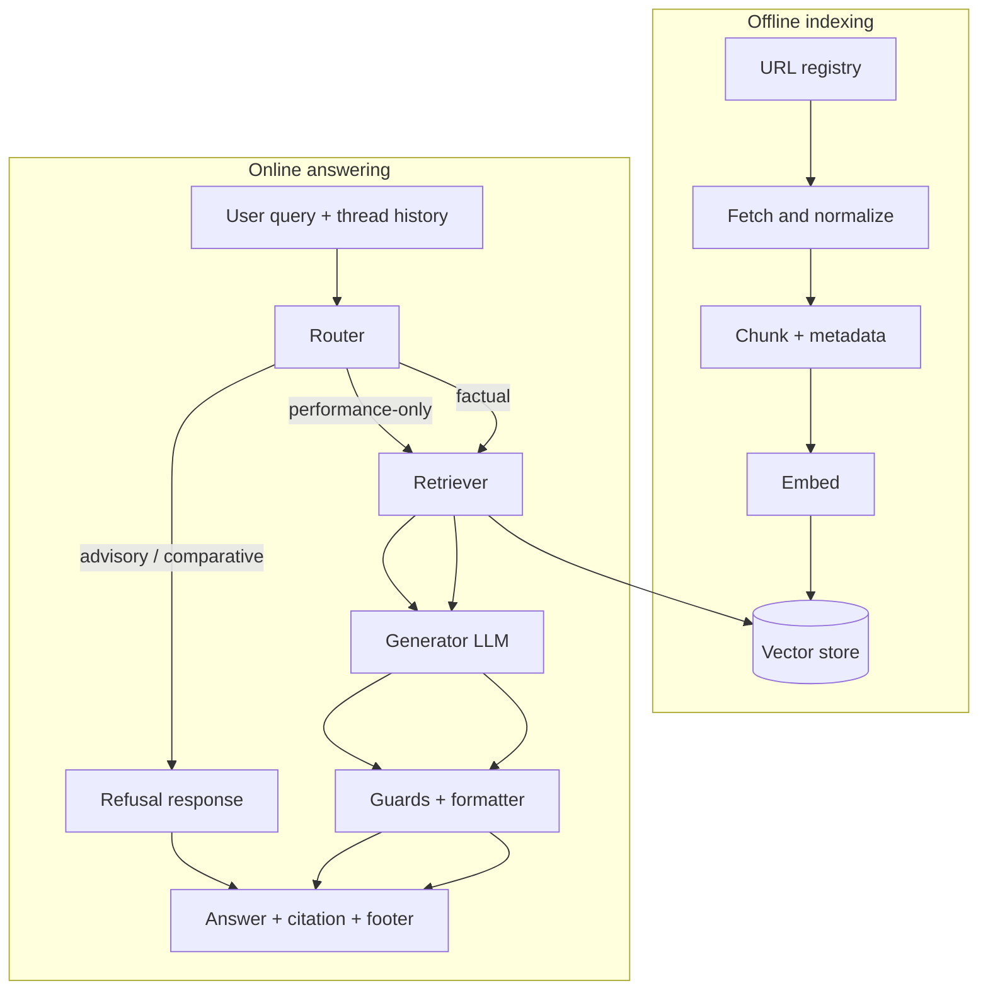

# RAG Architecture: Facts-Only Mutual Fund FAQ Assistant

This document describes the **retrieval-augmented generation (RAG)** architecture for the assistant defined in [problem statement](./problemStatement.md). It complements the phased rollout and file layout in [phased-architecture](./phased-architecture.md).

---

## 1. Design goals

| Requirement (from problem statement) | RAG implication |
|-------------------------------------|-----------------|
| Facts-only; no advice | **Retrieve-then-answer**: the model must not “know” fund facts without retrieved chunks; advisory queries **skip** grounded generation or use fixed refusal templates. |
| Official sources only | Corpus is **allowlisted** URLs (AMC, AMFI, SEBI); citations must resolve to those URLs. |
| One citation + “Last updated” | Retrieval selects **one primary chunk** (or document record) whose metadata supplies `source_url` and timestamps for the footer. |
| ≤ 3 sentences | Enforced in **prompt** and **programmatic guards** after generation. |
| Performance questions → factsheet link only | **Route** before heavy retrieval; retrieval constrained to `doc_type = factsheet` if needed; model must not emit performance numbers from memory. |
| Multiple chat threads | **Session-scoped dialogue history** for query rewriting only; retrieval index stays global; **no** mixing retrieved context across `thread_id`s. |

---

## 2. Components overview

| Component | Purpose | Implementation path |
|-----------|---------|------------------------|
| **URL registry & policy config** | Canonical list of 15–25 official URLs plus scheme labels; drives ingestion and citation allowlisting. | `config/url_registry.yaml`, `config/source_allowlist.txt`, `config/amc_schemes.yaml`; rules in `doc/POLICY.md` (see [phased-architecture](./phased-architecture.md) Phases 0–1). |
| **Corpus fetcher** | Pull raw PDF/HTML from registry URLs with retries and provenance timestamps. | `src/ingest/fetch.py`, `src/scripts/run_fetch.py`; artifacts under `data/raw/` (gitignored). |
| **Normalizer** | Convert heterogeneous files into clean text with stable `doc_id` and `source_url` linkage. | `src/ingest/normalize.py`; output under `data/processed/text/` + `manifest.json`. |
| **Chunker** | Split documents into retrieval units with metadata (`doc_type`, `scheme`, timestamps). | `src/chunking/chunk.py`; `data/chunks/chunks.jsonl`; optional `config/chunking.yaml`. |
| **Embedding model** | Map chunks and queries into vectors for similarity search. | `src/index/embed.py`; settings in `config/embedding.yaml` (same model id at index and query time). |
| **Vector store** | Persist chunk embeddings and metadata; serve top-k similarity queries with optional filters. | `src/index/vector_store.py`, `src/scripts/run_index.py`; persisted under `data/index/` (gitignored). |
| **Lexical index (optional)** | BM25 / keyword retrieval to hybridize with dense search for exact phrases (loads, ratios). | `src/index/hybrid.py`; index files under `data/bm25/` (gitignored). |
| **Query rewriter** | Turn follow-ups (“that fund”) into standalone retrieval queries using **thread-local** history only. | Small LLM call or heuristic layer inside API/`src/rag/` pipeline before embed step; never mixes `thread_id`s. |
| **Router** | Assign **refusal**, **performance-only**, or **factual** route before retrieval/generation. | `src/rag/router.py`; golden labels in `tests/fixtures/router_golden.yaml`; config in `config/retrieval.yaml` where relevant. |
| **Retriever** | Embed query, search vector store, dedupe/MMR, **select primary chunk** for the single citation URL. | `src/rag/retriever.py`; uses `src/index/vector_store.py` (+ optional hybrid). |
| **Context packer** | Assemble bounded excerpts + citation candidate + metadata for the LLM prompt. | `src/rag/context_packer.py`. |
| **Prompt templates** | Encode facts-only rules, sentence/url limits, and refusal wording. | `src/generation/prompts/*.md` (system, user wrap, refusal). |
| **Generator (LLM)** | Produce draft answer grounded on packed context; low temperature. | `src/generation/llm_client.py`; provider keys via environment only (`.env.example`). |
| **Guards & formatter** | Enforce ≤3 sentences, exactly one allowlisted URL, footer date, refusal educational link; repair or regenerate. | `src/generation/guards.py`, optional `render_answer.py`; tests in `tests/test_guards.py`. |
| **Session store** | Persist threads and messages per `thread_id` for multi-chat isolation. | `src/sessions/sqlite_store.py` (or equivalent); `data/sessions/threads.db` (gitignored). |
| **Chat API** | Orchestrate router → retriever → generator → guards; attach timestamps from chunk metadata. | `src/api/` (e.g. FastAPI): `routes/threads.py`, `routes/messages.py`; or equivalent service boundary. |
| **Frontend / BFF (optional)** | Minimal UI and HTTP facade; may proxy to Python RAG service. | Next.js under `frontend/` — Route Handlers `app/api/*/route.ts`, UI components under `frontend/components/` ([phased-architecture](./phased-architecture.md) Phase 7). |

---

## 3. End-to-end pipeline

Two planes: **offline indexing** (batch) and **online answering** (per message).



**Data artifacts**

- **Chunks**: short passages with metadata (`chunk_id`, `source_url`, `doc_type`, `scheme`, `fetched_at`, `indexed_at`).
- **Vector store**: embeddings over chunks only from the curated corpus.
- **Optional lexical index**: BM25 (or similar) over the same chunks for hybrid retrieval—helps phrases like exact loads or percentages.

---

## 4. Offline indexing (retrieval corpus)

### 4.1 Source of truth

- Input: **`config/url_registry.yaml`** (15–25 URLs) aligned with scheme diversity (3–5 schemes, multiple categories).
- Every indexed document must carry **`source_url`** matching an allowlisted prefix.
- In the **current iteration**, ingestion filters out these `doc_type` families: AMC KIM/SID PDFs, AMFI guidance pages, and statement/tax-related documents.
- Pipeline requirement: source-type inclusion must be configuration-driven (registry + filters), so these classes can be enabled later without redesigning ingestion/retrieval components.

### 4.2 Chunking strategy

- **PDFs** (factsheets): split by headings where possible; otherwise fixed windows with overlap so atomic facts (e.g. exit load table rows) are not split blindly.
- **HTML** (FAQ, regulator pages): extract main content; drop chrome so retrieval does not rank navigation boilerplate.

### 4.3 Metadata for filtering and citations

At query time you may filter by **`scheme`** (when resolved from the question or thread) and by **`doc_type`** (e.g. factsheet-only path for performance queries).

---

## 5. Online answering (core RAG loop)

### 5.1 Inputs

- **Current user message**
- **`thread_id`** and **recent turns** (e.g. last 6–10) for resolution of pronouns (“that scheme”) — **rewrite or prepend** a compact standalone query for retrieval only; do not change stored user text unless you explicitly log both.

### 5.2 Router (before retrieval)

Lightweight classifier or rule layer assigns **route**:

| Route | Trigger examples | Retrieval | Generation |
|-------|------------------|-----------|------------|
| **Refusal** | “Should I buy?”, “Which fund is better?” | Skip or minimal (for wording only) | Template refusal + **one** educational SEBI link |
| **Performance-only** | Past returns, CAGR, ranking | Restrict to **factsheet** chunks only | Short boilerplate + **factsheet URL**; **no** numeric performance from LLM |
| **Factual** | Expense ratio, SIP minimum, lock-in | Full corpus with optional filters | Grounded answer from retrieved text |

Routing errors matter: false **factual** on an advisory question violates compliance; prefer **refusal** when uncertain.

### 5.3 Retrieval

1. **Embed** the (possibly rewritten) query with the **same embedding model** used at index time.
2. **Search** vector store with **top-k** (e.g. 5–8).
3. **Optional**: fuse with lexical scores (hybrid).
4. **Post-process**: dedupe near-identical chunks; apply **MMR** if chunks collapse to one PDF page.
5. **Select primary chunk**: single chunk whose **`source_url`** becomes the **exactly one** user-visible citation (fallback: highest score after dedupe).

### 5.4 Context packing for the LLM

Pass to the generator:

- **System instructions**: facts-only; use **only** provided context; no advice; max three sentences; exactly one URL from metadata; if insufficient context, say so and point to official doc link from metadata or registry.
- **User**: question + **bounded retrieved excerpts** (often 1–3 chunks; citation URL still **one** — the primary chunk’s URL).

Avoid stuffing unrelated schemes into context when the query names one scheme—use metadata filters.

### 5.5 Generation

- **Low temperature** (e.g. 0.1–0.3) to reduce hallucinations.
- Prefer **structured output** internally (e.g. JSON with `sentences`, `citation_url`) then render to plain text so guards have hooks.

### 5.6 Guards and formatter

Programmatic checks before returning to UI/API:

- Sentence count ≤ 3  
- Exactly **one** HTTP(S) URL in the answer body **and** URL ∈ allowlist  
- Append footer: `Last updated from sources: <date>` using **`max(fetched_at, indexed_at)`** over chunks used  
- Refusal path: educational link present  

On failure: regenerate once with stricter instruction, or **deterministic repair** (inject canonical `source_url` from retrieval).

---

## 6. Multi-thread behaviour (RAG-specific)

```mermaid
sequenceDiagram
  participant UI
  participant API
  participant Router
  participant Retriever
  participant VS as Vector store
  participant LLM

  UI->>API: POST message threadId=A
  API->>Router: query + history(A)
  Router->>Retriever: standalone query
  Retriever->>VS: similarity search
  VS-->>Retriever: chunks
  Retriever->>LLM: context + query
  LLM-->>API: draft answer
  API->>API: guards + persist message(A)
  API-->>UI: answer + citation + footer

  Note over UI,LLM: threadId=B uses separate history; same VS index
```

- **Shared**: embeddings index, URL registry, chunk metadata.  
- **Isolated**: message lists per thread; retrieval queries never attach another thread’s messages.

---

## 7. Failure modes and safe defaults

| Situation | Behaviour |
|-----------|-----------|
| No chunk above similarity threshold | Brief “not found in official corpus” style reply + suggest checking AMC factsheet link from registry **without inventing URLs**. |
| Conflicting chunks | Prefer **single primary** citation; answer only what is stated in that chunk if conflict persists. |
| User asks for performance numbers | Performance route: **factsheet link only**, no fabricated metrics. |
| Model emits extra URLs | Strip or replace via guard; cite **only** retrieval-selected URL. |

---

## 8. Evaluation (RAG quality)

Measure separately:

1. **Retrieval**: Hit@k — does the correct `source_url` appear in top-k for golden questions?  
2. **Grounding**: Do answers avoid facts absent from retrieved text?  
3. **Compliance**: Router precision/recall on advisory vs factual; refusal template adherence.  
4. **Format**: Three sentences, one URL, footer present.

Golden sets belong under **`evaluations/`** as described in [phased-architecture](./phased-architecture.md) Phase 8.

---

## 9. Summary diagram (compact)

```text
 URL registry → fetch → chunk → embed → [Vector store]
                                              ↑
User query ─→ router ─→ (refusal | constrained | full) retrieve ─→ LLM(context, query) ─→ guards ─→ response
                ↑
         thread history (scoped per thread_id)
```

---

*Keep this document aligned with [problemStatement.md](./problemStatement.md) when scope or policies change.*
